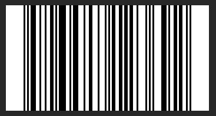

# EAN-Barcode to .PBM (Portable Bitmap)

Tiny Program to save a Barcode in .pbm (Portable Bitmap Format) file from a 13-Digit EAN-Number.

Height is hardcoded set to 60 pixel, width is the size(length) of the string.

No error-exceptions added.

Use and modify as you like.

Screenshot taken in Photoshop 2020

